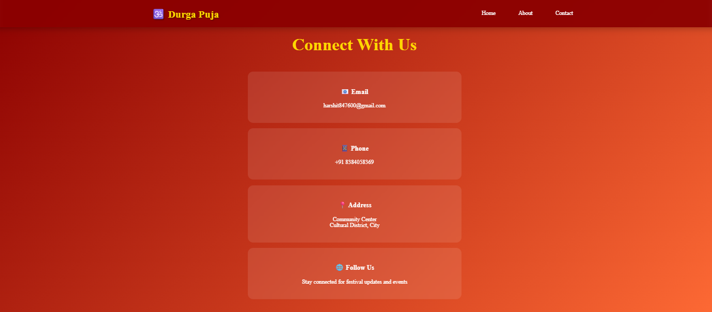

# 🕉️ Durga Puja Festival Website

A beautiful, responsive website celebrating the sacred Hindu festival of Durga Puja. This project showcases the divine feminine power of Goddess Durga with traditional aesthetics and modern web design.

## 🌟 Live Demo


## 📸 Screenshots

### Home View


### About View


### Contact View


## ✨ Features

### 🎨 Design & Aesthetics
- **Traditional Color Scheme**: Deep reds, golds, and oranges representing the festival
- **Animated Gradient Backgrounds** with floating effects
- **Custom Durga Ma Illustration** in the hero section
- **Smooth Animations** and hover effects throughout
- **Cultural Authenticity** with Hindi text and traditional elements

### 📱 Responsive Design
- **Mobile-First Approach** - Optimized for all screen sizes
- **Collapsible Hamburger Menu** for mobile devices
- **Flexible Grid Layouts** that adapt beautifully
- **Touch-Friendly Navigation** on mobile devices

### 🔧 Technical Features
- **Smooth Scrolling Navigation**
- **Scroll-Triggered Animations**
- **Interactive Elements** with hover effects
- **Cross-Browser Compatibility**
- **Optimized Performance**
- **Semantic HTML Structure**

## 🛠️ Technologies Used

- **HTML5** - Semantic markup and structure
- **CSS3** - Modern styling with animations and responsive design
- **JavaScript** - Interactive functionality and smooth scrolling
- **CSS Grid & Flexbox** - Responsive layout systems
- **CSS Animations** - Smooth transitions and effects

## 📁 Project Structure

```
durga-puja-website/
│
├── index.html          # Main HTML file
├── styles.css          # All CSS styles and animations
├── script.js           # JavaScript functionality
├── README.md           # Project documentation
└── 1,2,3.png/        # Website screenshots
  
```

## 🚀 Quick Start

### Prerequisites
- A modern web browser (Chrome, Firefox, Safari, Edge)
- Basic understanding of HTML/CSS/JavaScript (for customization)

### Installation

1. **Clone the repository**
   ```bash
   git clone https://github.com/your-username/durga-puja-website.git
   ```

2. **Navigate to the project directory**
   ```bash
   cd durga-puja-website
   ```

3. **Open in browser**
   - Simply open `index.html` in your preferred web browser
   - Or use a local server for better development experience:
   ```bash
   # Using Python (if installed)
   python -m http.server 8000
   
   # Using Node.js (if installed)
   npx serve .
   ```

4. **View the website**
   - Open your browser and go to `http://localhost:8000`

## 🎯 Sections Overview

### 🏠 Home Section
- **Hero Banner** with animated gradient background
- **Durga Ma Image** with floating animation
- **Blessing Message** in both Hindi and English
- **Call-to-Action** elements

### 📖 About Section
- **Festival Description** explaining the significance of Durga Puja
- **Cultural Information** about traditions and celebrations
- **Festival Highlights** with interactive cards:
  - 🎭 Cultural Programs
  - 🏛️ Pandal Decorations
  - 🙏 Sacred Rituals
  - 🍛 Traditional Food

### 📞 Contact Section
- **Contact Information** with beautiful card design
- **Email, Phone, Address** details
- **Social Media Links** placeholder
- **Interactive Elements** with hover effects

## 🎨 Customization Guide

### Colors
The website uses a traditional festival color palette:
```css
--primary-red: #8B0000;
--accent-orange: #FF6B35;
--gold: #FFD700;
--light-cream: #FFF8E1;
```

### Fonts
- Primary Font: Georgia (serif) for traditional feel
- Fallback: System serif fonts

### Images
- Replace the SVG illustration with your own Durga Ma image
- Update the path in `styles.css`:
```css
.durga-image {
    background: url('path/to/your/image.jpg') center/cover;
}
```

## 📱 Responsive Breakpoints

```css
/* Mobile Devices */
@media (max-width: 480px) { ... }

/* Tablets */
@media (max-width: 768px) { ... }

/* Desktop */
@media (min-width: 1024px) { ... }
```

## 🤝 Contributing

Contributions are welcome! Here's how you can help:

1. **Fork the repository**
2. **Create a feature branch**
   ```bash
   git checkout -b feature/amazing-feature
   ```
3. **Commit your changes**
   ```bash
   git commit -m 'Add some amazing feature'
   ```
4. **Push to the branch**
   ```bash
   git push origin feature/amazing-feature
   ```
5. **Open a Pull Request**

### Contribution Ideas
- 🌍 Add multi-language support
- 🎵 Include traditional music/audio
- 📅 Add festival calendar/countdown
- 🖼️ Create image gallery section
- 🎪 Add event management features

## 🐛 Known Issues

- [ ] Safari iOS scroll animation performance
- [ ] IE11 CSS Grid compatibility (if needed)

## 📝 License

This project is licensed under the MIT License - see the [LICENSE](LICENSE) file for details.

## 🙏 Acknowledgments

- **Cultural Inspiration**: Traditional Durga Puja celebrations
- **Design Inspiration**: Indian festival aesthetics
- **Community**: Hindu cultural traditions and values

## 📧 Contact

**Your Name** - [your.email@example.com](mailto:your.email@example.com)

**Project Link**: [https://github.com/your-username/durga-puja-website](https://github.com/your-username/durga-puja-website)

---

### 🕉️ May Maa Durga bless everyone with peace and prosperity 🕉️

**Built with devotion and respect for our cultural heritage** ❤️

---

## ⭐ Show your support

Give a ⭐️ if this project helped you celebrate Durga Puja digitally!

## 📊 Project Stats


